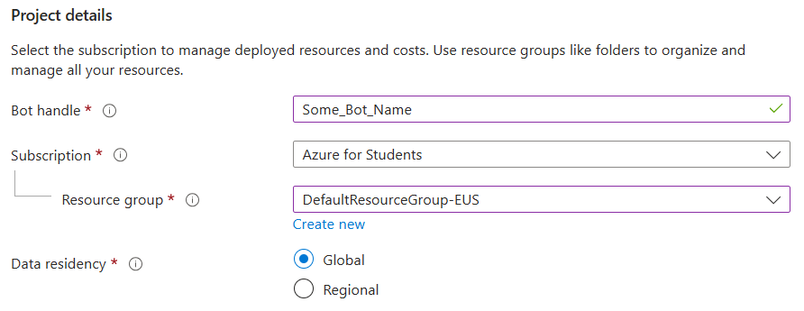
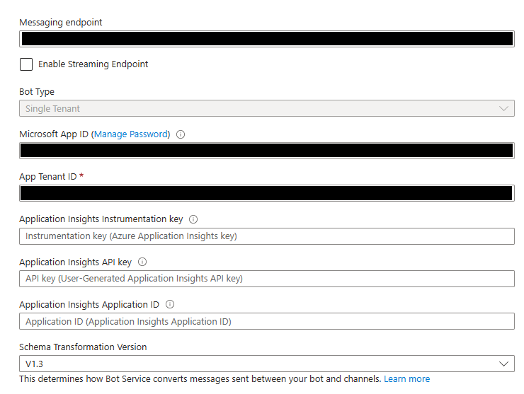

# Microsoft Teams Bot
This repository shows how to get a chat bot working on Microsoft Teams. This bot is also performs the same functionalities as [this Webex bot](https://github.com/banhao/WebExBot). There was not much documentation I could find about creating a Microsoft Teams bot using Python, and a lot of the documentation was either unclear or outdated.
So, I created this repository as a sort of documentation to explain how to set up a Microsoft Teams bot using the Azure Bot Service.

## How to set up the Microsoft Teams bot using Azure Bot Service
### NOTE: THIS GUIDE IS FOR SINGLE TENANT APPLICATIONS, I am not familiar with setting up a Bot using the User Assigned Managed Identity
1. Pull this repository to get the structure of the bot. You can also refer to the [Samples repository](https://github.com/microsoft/BotBuilder-Samples) to get a cleaner structure for the bot
2. Run <code>pip install -r requirements.txt</code> to install all the dependencies
3. Now, just set <code>APP_TYPE = "SingleTenant"</code> since this guide is about creating a Single Tenant Azure bot. We will cover the remaining configurations later.
4. **(OPTIONAL)** The ngrok tunnel is only opened upon starting the Python script as seen in **app.py**. You can remove all the ngrok lines and start the tunnel using a CLI. This guide does not cover ngrok however, so you can figure it out yourself.
5. We can move onto the Azure part. Start off by creating an Azure Bot resource.
    \
    Fill out the **Project Details** normally.
    \
    For the **Microsoft App ID**, select Single Tenant, and fill out the Single Tenant Application information.
    
6. Once you have created the bot, enter into the bot's configurations on Azure.
    
    - The **Bot Type** and **Microsoft App ID** should already be filled and you should not be able to change it.
    - The messaging endpoint should be set to the URL of the machine that will be running the script. It should look something like this: <code>https://***{Endpoint}***/api/messages</code> where the ***Endpoint*** would be the domain/ip address used to reach the machine running the script.
        - To make this simple, all I did was sign up for an ngrok account, create a static domain, and I used the static domain as the messaging endpoint. The traffic will be tunneled to this device. This can be further shown under the [System Design for the Microsoft Teams Bot](#system-design-for-the-microsoft-teams-bot).
        - I added the path */api/messages* to the endpoint since this script will be listening for Teams message traffic through this path (this part is written in **app.py**)
    - I am not 100% sure about **App Tenant ID**, but I used my Organization's Entra Tenant ID (owner of the app) for the App Tenant ID.
7. Now that the configurations for the Azure Bot have been set, you can now change the remaining parts of **config.py**. The values to be set (except for <code>PORT</code>) should all be strings.
    - Set the <code>APP_ID</code> to the **Microsoft App ID** in the **config.py**
    - Set the <code>APP_PASSWORD</code> to the password of the Single Tenant Application
    - Set the <code>APP_TENANTID</code> to the **APP Tenant ID** of the Azure Bot configuration
8. Most of the configurations should be done at this point, and we should be able to move onto the bot deployment. All that you require to deploy the bot is to create a **manifest.zip** file. We will first fill out the Basic information of **manifest.zip** .Open [this link](https://dev.teams.microsoft.com) and navigate to **Apps** on the left .
    \
    Select **New App**
    \
    Fill out the bot's name and just keep the version as **Latest Stable (v1.23)** (we will discuss this later)
    \
    Fill out the Basic information of the bot, the required fields should be marked with a red asterisk
    \
    Scroll to the bottom of Basic information until you see **Application (client) ID**. **You should fill this section with the Single Tenant Application's ID**; this would be the **Microsoft App ID** on the Azure Bot configuration as well as the <code>APP_ID</code> of config.py.\
    
9. After filling out the Basic information, you need to add the bot App onto the manifest. Navigate to **App features** and click the **Bot** feature.
    \
    For **Identify your bot**, I selected the second option (**Enter a bot ID**), and I used the Single Tenant Application's ID.
    \
    Fill out the bot's permissions and scopes. For this bot, I only gave the bot the permission to "Upload and download files", and I made the bot available to everyone.
    \
    Click **Save**, and the manifest file should be completed now.
10. **(OPTIONAL)** You may also ignore the previous step and crete the manifest file shown in this step. I have uploaded a copy of the manifest file that worked for me so that you can just fill out the required IDs. The manifestVersion is older however (1.19), and there is an extra staticTabs feature in this file. Once you have filled out the required areas, you can copy the file contents and directly edit the manifest.json file. Go to **App package editor** and select **manifest.json**.
    \
    Now, you should see the contents of the json file. Just paste the contents of the "old" manifest file (the 1.19 version)
    \
    \
    Click **Save** on the top right corner. You should now be redirected to the main App package editor screen. Click **Update** on the top left corner.
    \
    Confirm the edits.
    \
    The manifest file should be completed now.
11. Now that the manifest has been completed, you need to download and upload the zip file to Microsoft Teams. Navigate back to **Apps** on the left sidebar.
    \
    Under your application, click the three dots and select **Download app package**
    
    

## System Design for the Microsoft Teams Bot
(insert image here)

In my earliest commit, you may see that the file contents for bot.py look completely different. This is because I tried using the Teams AI framework first to build the bot, but I ran into some trouble dealing with file upload. So I ended up using BotBuilder instead.
